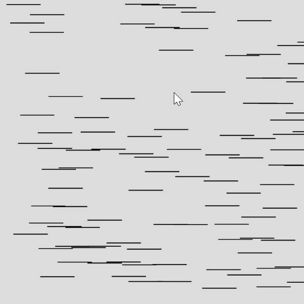

# Pinguins Huddle
Attempt to create a groupe dynamic, inspired by pinguins huddle or birds floats.

**Goals**
- Deepen understanding of classes

**Issues**
- How to modelise the movement of the group. Should we have a class for each pinguins and the one for the huddle ?