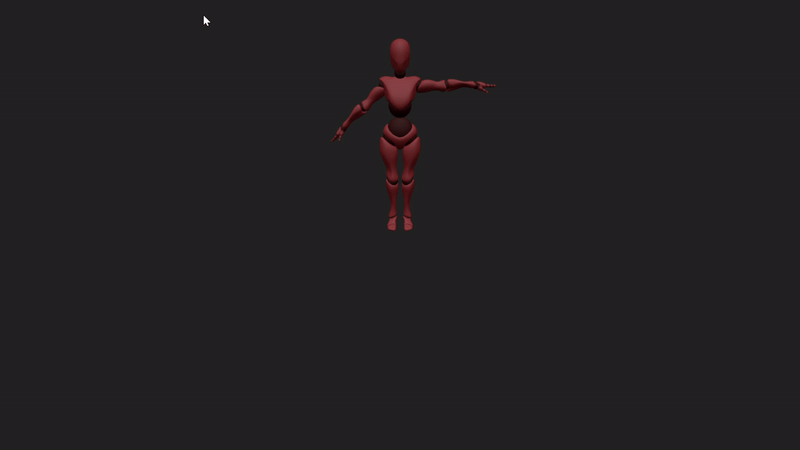

# Puppeteer
Demo that show you can move the arm of a 3D puppet using your mouse.

**Major issue**
- coding/rigging all jonction with IA chat
- Y axis where inverted
- How to manage camera position and light in Three.js

#### Credits
mixamo 3d model :https://www.mixamo.com/#/
