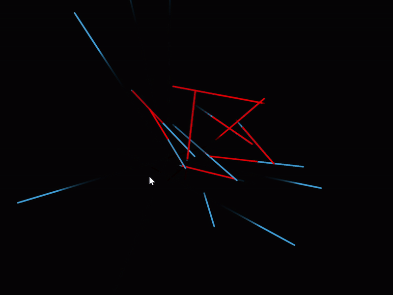

# Worms
Demo where a "worm" is created where you click on the canvas and then move into a random direction. When a worm collid with another worm, they change direction and emit a sound. While in contact, they turn red.

**Goals** :
- Gain a deeper understanding of class structures and object-oriented design

- Experiment with integrating sound elements into visual sketches

- Develop an interactive project derived from a minimal visual motif (lines)