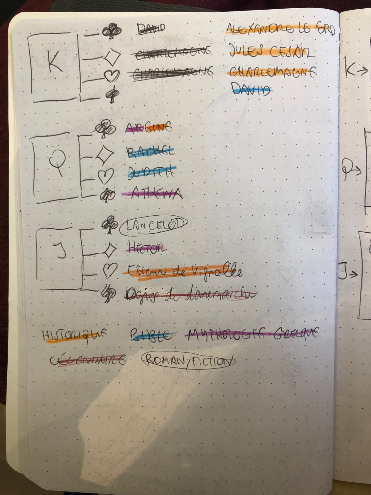
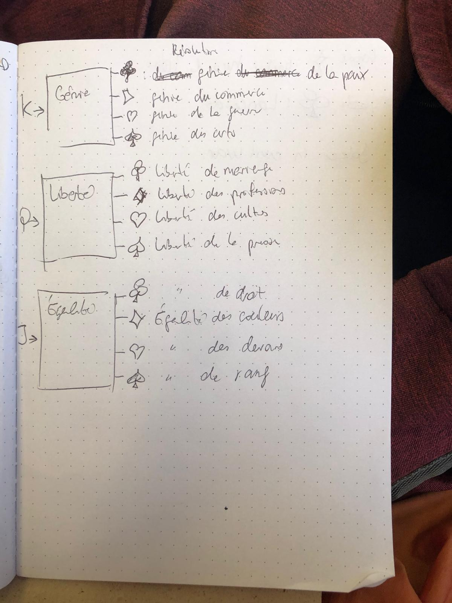
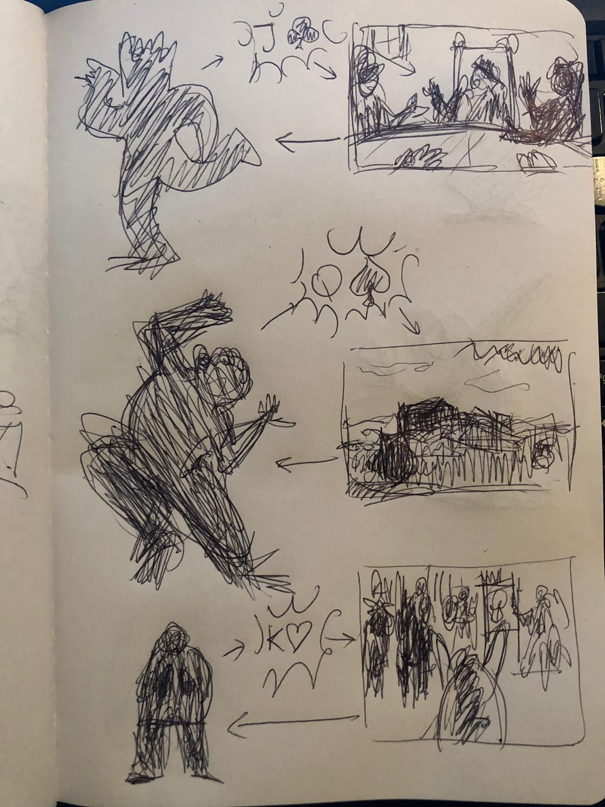

# Julia SANGNAKKARA

## Research
How people and their cultural background, shaped the suits and the usage of cards through history.

- Court suits in the french decks represents famous historical and legendary figures (Athena, Charlemagne, Lancelot, ...)

- In 1793, a card game with signs inspired by the ideas of the revolution was created.

- User input is hugely influenced by the way the service is asking them to act, move.

## History on a move
I'm interested in how people can experience the idea they can make "history" move ,that's their part of it, even the small ones. 

## Keyword
Embodied

## User Journey

## Novel Combinations
- Gesture
- History
- Unfold