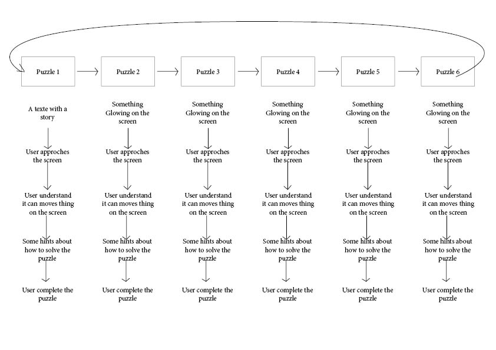

# Rokhy NIANG, Miaozheng Qiu, Julia SANGNAKKARA

## Research
Our research focuses on the history and evolution of playing cards, from ornate and symbolic origins to the simplified, minimal designs we know today and the cultures that influenced them.

- Characters/suits : In poker, the characters on the cards are static and almost invisible to the players, who focus only on numbers and suits. Tarot, however, shifts attention to the card imagery. Every figure, gesture, and symbol is loaded with meaning. The characters are no longer silent decorations but narrators of hidden stories.

- Playing cards history is still evolving. (History is not "over"). Ex : pokemon cards, board games, ... video games (Balatro)

- Mamluk's cards have poem written on them.

- A French revolution deck of cards has been invented after the revolution of 1789. From 1793, it was forbidden to print "fleur de lys", the symbol of monarchy, on paper. 

## ChronoCards
Players must solve puzzles to open doors that will move them through time, from the origin of the cards, until today, even into the future. We are interested in the idea that people will learn about human history by completing puzzles that will open doors for them to move forward in human history.

# Keyword
Discovery

## User's journey

## Novel combination
- Timeline
- Puzzle
- Gesture