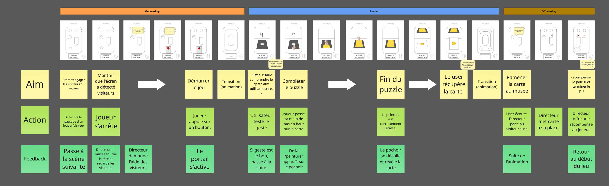

# Rokhy NIANG, Julia SANGNAKKARA

## KronoCards
A game where the player takes on the role of a time-traveling explorer sent by the Museum of Games to restore a stolen collection of playing cards. By stepping through portals, they journey across different eras and encounter unique scenes where they must find, reconstruct, or craft the cards, adapting to the materials, techniques, and styles of each period, all the way back to the very first playing cards in history.

## Interaction
Puzzle/scene 1 : The hand acts as a brush to create a card through stenciling.

## User's journey (overview)

[Link to Mirò user's journey (full quality)](https://miro.com/welcome/R1JCT2hUbGlUMTQzdDBhTm9nV0VNSm5IYmZwQzcxdFlxOWQ4THl5WVF3WnZHcU1ubFBZUGVTeTFJVDVIZmFUVVVpSDd3L1MzSys1N1IrWEpqMFVHU1NDUjk0MGhPbyt2cVJtYnkyTkdvNXZKSE9TUkx1UnJtaEU3RGE2eU5QamhhWWluRVAxeXRuUUgwWDl3Mk1qRGVRPT0hdjE=?share_link_id=556569699506)